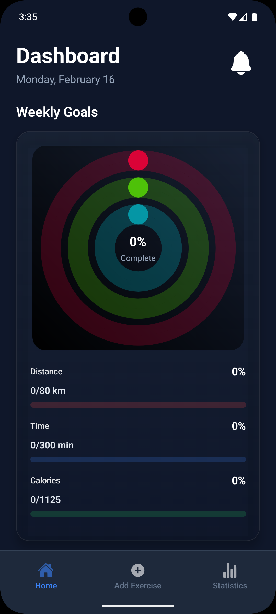
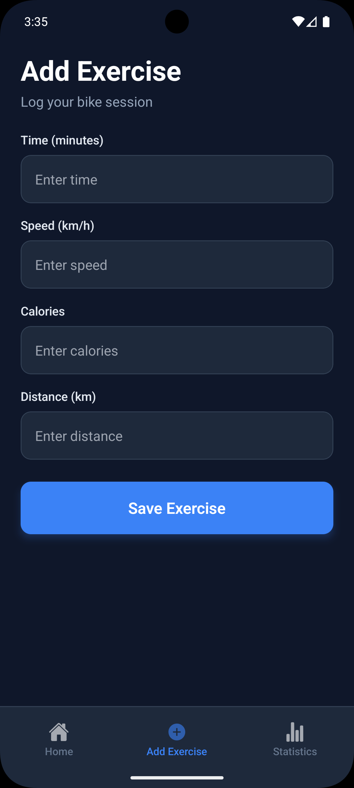
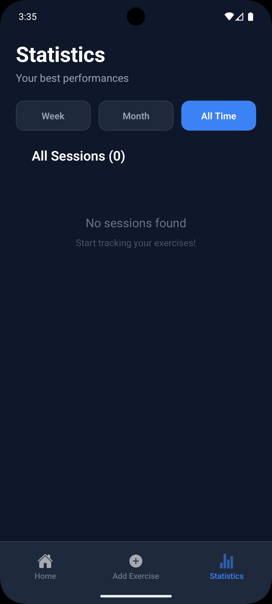

# Bike Tracker🚲

This app was created to support your daily indoor cycling sessions, it allows you to log each workout by entering key data such as duration, average speed, distance, and calories burned.
The app also includes weekly goals that automatically reset every Monday. In the History tab, you can review your recent workouts, compare performance over time, and track your personal records.


## Screenshots
<p align="center">
  
  
   
</p>


## Get started

1. Install dependencies

   ```bash
   npm install
   ```

2. Start the app

   ```bash
   npx expo start
   ```


## Learn more

To learn more about developing your project with Expo, look at the following resources:

- [Expo documentation](https://docs.expo.dev/): Learn fundamentals, or go into advanced topics with our [guides](https://docs.expo.dev/guides).
- [Learn Expo tutorial](https://docs.expo.dev/tutorial/introduction/): Follow a step-by-step tutorial where you'll create a project that runs on Android, iOS, and the web.
